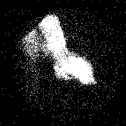

# Segmentation using gray threshold

1. Compile c code: ```./compilegcc SegmentationWithThreshold``` 
2. Run executable file: ```./SegmentationWithThreshold your_input_image```
3. Input the threshold of gray level: ```100```
4. Output 2 images: original image, segmentation image
5. Results
<br>


<br>


<br>


